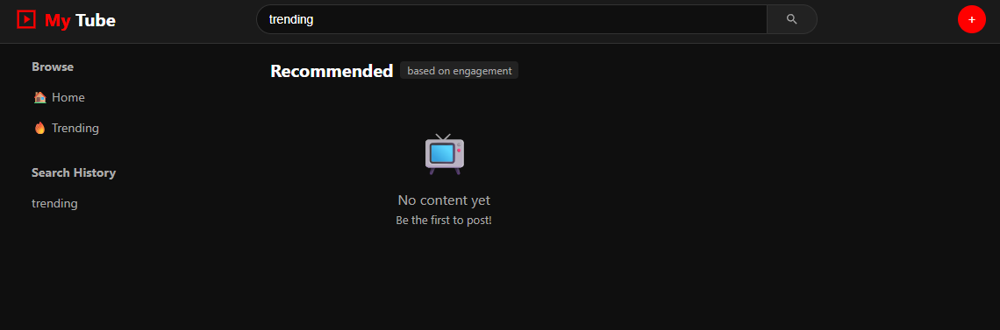
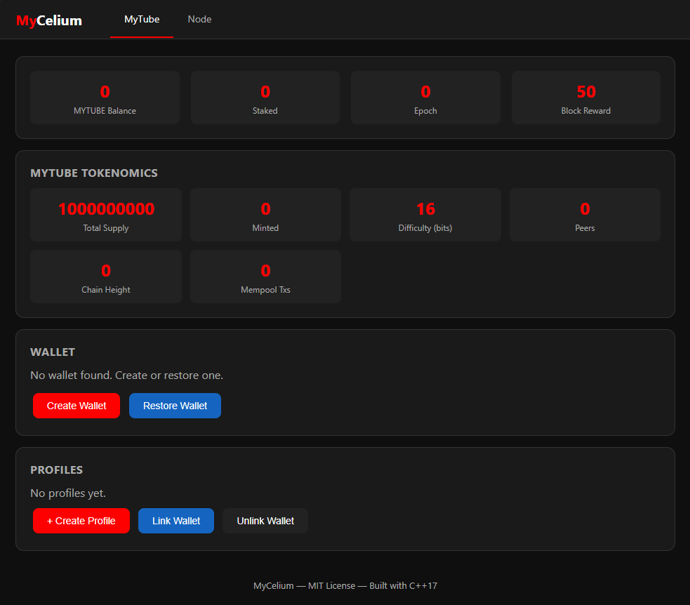
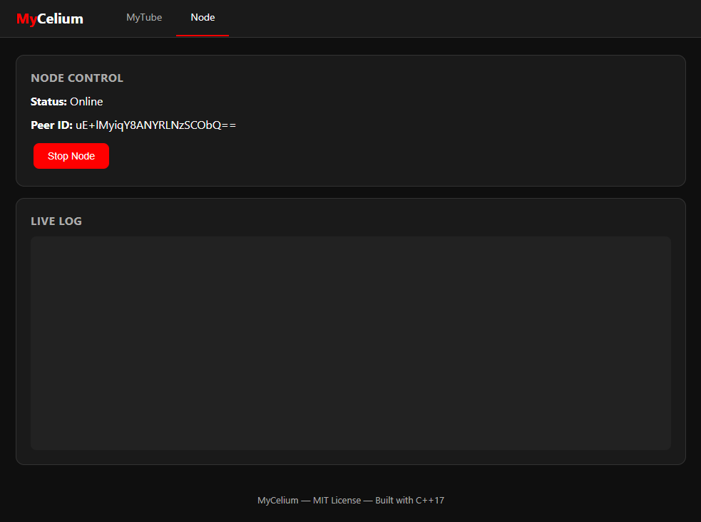
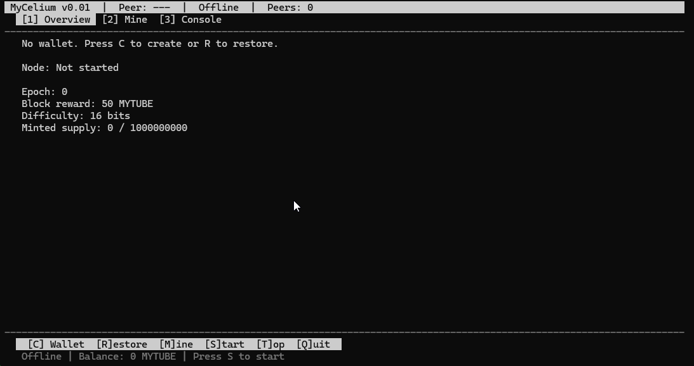
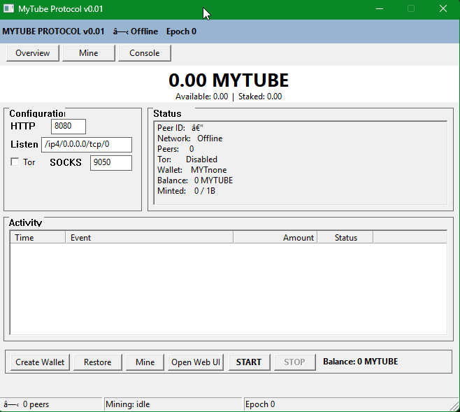

# MyTube Protocol

**A YouTube-Inspired P2P Video Network with Quantum-Resistant Security and Social Mining**

[](LICENSE)
[](https://en.cppreference.com/w/cpp/17)
[]()

## Overview

MyTube is a decentralized peer-to-peer video network — like YouTube, but without the central server. Users own their data, host video chunks on peer nodes for fees, and earn through "Social Mining" — a native token reward system for network participation.

Zero external dependencies, no virtual dispatch, no async runtime, no garbage collection. All crypto primitives are self-contained — SHA-256, HMAC, HKDF, X25519, Ed25519, and AES-256-GCM — with the same post-quantum hybrid interfaces as the original Rust spec. Every module is a single `static inline` header. The project builds in seconds to a ~128 KB static binary.

### Key Features

- **User-Owned Data**: Posts and media encrypted with user-controlled keys
- **Peer Hosting**: Trusted nodes host your data for token rewards
- **Video Hosting**: Encrypted chunked video with bandwidth-weighted peer selection
- **Terminal UI**: Full keyboard-driven dashboard (wallet, mining, console)
- **Web Dashboard**: REST API + JS client for live status, wallet, mining, profiles
- **Windows GUI**: Native desktop management interface
- **PoW Mining**: SHA-256 hash brute-force with halving and difficulty adjustment
- **Social Mining**: Earn tokens by relaying data, hosting, creating, and engaging
- **Quantum-Resistant**: Hybrid X25519 + Kyber-768 + AES-256-GCM
- **Tor / Onion**: Run nodes over Tor hidden services with auto-derived `.onion` addresses

## Screenshots











## Quick Start

### Build

```bash
git clone https://github.com/retiredroca/Mycelium.git
cd Mycelium/mycelium-cpp
g++ -std=c++17 -O2 -Isrc src/main.cpp -o mycelium.exe -lws2_32 -lpthread -lbcrypt -lgdi32 -lcomctl32
```

Or with CMake:

```bash
cmake -B build
cmake --build build --config Release
./build/Release/mycelium status
```

**Prerequisites**: C++17 compiler (MSVC 2022+, GCC 9+, Clang 10+), CMake 3.20+.

### Start a Node

```bash
# Full node with P2P networking + web UI
./mycelium start --http-port 8080

# Web-only mode (no TUI/GUI) with dual ports
./mycelium webonly --http-port 8080 --mgmt-port 8081
```

Open [http://localhost:8080](http://localhost:8080) for the YouTube-style client and [http://localhost:8081](http://localhost:8081) for the management dashboard.

### Basic Commands

```bash
# Wallet
./mycelium wallet create                     # Create wallet (balance starts at 0)
./mycelium wallet balance                    # Check balance

# Mining
./mycelium mine                              # Mine a block (auto-creates wallet)

# Profile
./mycelium profile create --display-name "Alice" --username alice

# Posts
./mycelium post --content "Hello, MyTube!"
./mycelium video upload --video-id "my-video" --duration 120000 --chunks 4

# Network
./mycelium start --listen /ip4/0.0.0.0/tcp/4001
./mycelium status                            # View network state

# Config
./mycelium config generate --path ./mycelium.json
./mycelium config show
```

## Web UI

MyTube ships with an **embedded web dashboard** served directly from the binary — no external web server, no static files. The HTML, CSS, and JavaScript are compiled into `myc_web.hpp` as raw string literals and served via a built-in synchronous TCP listener.

Two interfaces are available:

| Port | Page | Purpose |
|------|------|---------|
| **8080** | Client | YouTube-style feed, profiles, social features |
| **8081** | Mgmt | Wallet, mining, node control, live log |

```bash
./mycelium webonly --http-port 8080 --mgmt-port 8081
```

The management dashboard provides:

- **Node Control**: Start/stop the P2P node
- **Wallet**: Create, restore, check balance and staking
- **Mining**: Mine tokens, view epoch and difficulty
- **Profiles**: Create and switch between multiple profiles
- **Live Log**: Real-time node activity stream
- **Tokenomics**: Supply, rewards, and emission stats

When combined with `--tor`, the node also displays a `.onion` web URL for privacy-preserving remote access.

## CLI Reference

### Node Management

| Command | Description |
|---------|-------------|
| `start --http-port PORT` | Start full node with web UI |
| `webonly --http-port PORT --mgmt-port PORT` | Web-only mode (no TUI/GUI) |
| `status` | Display node and wallet state |
| `config show` | Show effective configuration |
| `config generate --path FILE` | Generate default config file |

### Wallet

| Command | Description |
|---------|-------------|
| `wallet create` | Create new wallet (auto-generates keys) |
| `wallet balance` | Show wallet balance and staking |
| `mine` | Mine one block via SHA-256 PoW |

### Profile & Posts

| Command | Description |
|---------|-------------|
| `profile create --display-name NAME --username USER` | Create channel |
| `post --content TEXT` | Create text post |
| `video upload --video-id ID --duration MS --chunks N` | Upload video manifest |

### Network

| Command | Description |
|---------|-------------|
| `start --listen ADDR` | Start node on specific address |
| `start --tor` | Enable Tor hidden service |
| `start --tor --tor-socks-port PORT` | Custom SOCKS5 port |
| `start --config FILE` | Start with JSON config file |

## Architecture

```
┌─────────────────────────────────────────────────────────────┐
│                      CLIENT LAYER                           │
│    C++ CLI  │  Embedded Web UI (--http-port)                │
│    (future: WASM / Native)                                  │
└───────────────────────────┬─────────────────────────────────┘
                            │
┌───────────────────────────▼─────────────────────────────────┐
│                    VIDEO / MEDIA LAYER                      │
│  Chunked Encryption  │  Streaming Slots  │  Bandwidth Mgmt  │
└───────────────────────────┬─────────────────────────────────┘
                            │
┌───────────────────────────▼─────────────────────────────────┐
│                       P2P NETWORK                           │
│  Kademlia DHT  │  Gossip  │  Peer Table  │  TCP Framing    │
└───────────────────────────┬─────────────────────────────────┘
                            │
┌───────────────────────────▼─────────────────────────────────┐
│                    QUANTUM-RESISTANT CRYPTO                  │
│  Hybrid Encryption  │  Hybrid Signatures  │  Key Management │
└───────────────────────────┬─────────────────────────────────┘
                            │
┌───────────────────────────▼─────────────────────────────────┐
│                     TOKEN LAYER                              │
│        Staking  │  Rewards  │  Fee Burn  │  Governance      │
└─────────────────────────────────────────────────────────────┘
```

### Project Structure

```
mycelium-cpp/
└── src/
    ├── main.cpp                   # CLI application
    ├── config/myc_config.hpp      # JSON config loading
    ├── crypto/myc_crypto.hpp      # All crypto (SHA-256, X25519, Ed25519, AES-256-GCM, hybrid PQ)
    ├── protocol/myc_protocol.hpp  # Wire format messages
    ├── post/myc_post.hpp          # Post struct & lifecycle
    ├── storage/myc_storage.hpp    # Encrypted local storage
    ├── token/myc_token.hpp        # Tokenomics, wallet, staking
    ├── social/myc_social_graph.hpp # Follow/block graph
    ├── profile/
    │   ├── myc_profile.hpp        # Profile, ProfileBuilder
    │   ├── myc_profile_theme.hpp  # Theme presets, colors
    │   ├── myc_profile_layout.hpp # Layout sections, widgets
    │   └── myc_profile_validation.hpp
    ├── guestbook/myc_guestbook.hpp
    ├── media/myc_video.hpp        # VideoMetadata, chunking, codecs
    ├── web/myc_web.hpp            # Embedded HTML + HTTP server
    ├── identity/myc_identity.hpp  # Username registry
    └── p2p/myc_p2p.hpp            # Peer table, gossip, node
```

## Concepts

### Video & Post Lifecycle

Content on MyTube has a Time-To-Live (TTL) extended through viewer engagement:

| State | TTL | Extension |
|-------|-----|-----------|
| Fresh | 24h | +2h per view, +4h per share |
| Trending | 48h+ | +6h per comment, +12h per share |
| Permanent | ∞ | Stake tokens |

```
Uploaded ──► Fresh (24h TTL) ──► Trending (Score ≥ 1000) ──► Permanent (Staked)
                │                      │
                └── View +2h           └── More engagement
                └── Share +4h          └── Stake tokens
                └── Comment +6h
```

### Tokenomics

MYTUBE tokens enter circulation through **proof-of-work mining** — no pre-mine, no ICO. Every token is mined into existence.

| Parameter | Value |
|-----------|-------|
| Total Supply | 1,000,000,000 MYTUBE (hard cap) |
| Block Reward (epoch 0) | 50 MYTUBE |
| Halving Interval | Every 210,000 epochs |
| Initial Difficulty | 16 leading zero bits |
| Mining Algorithm | SHA-256(pubkey ‖ nonce ‖ epoch) |

**Reward Distribution** — mined supply is distributed through Social Mining pools:

| Category | Share | Description |
|----------|-------|-------------|
| Relay Rewards | 35% | Data forwarding, gossip propagation |
| Hosting Rewards | 40% | Peer storage + video hosting bandwidth |
| Creation Rewards | 15% | Hype milestones |
| Engagement Rewards | 10% | Viewers, sharers, commenters |

**Utility Actions** — token uses for network services:

| Action | Mechanism | Amount |
|--------|-----------|--------|
| Post Permanence | Stake (returnable) | 100 – 10,000 |
| Hosting Slot | Stake (returnable) | 500 – 50,000 |
| Video Streaming | Stake (returnable) | 1,000 – 100,000 |
| Verified Identity | Burn | 50 |
| Network Fees | Burn | Variable |

## Deployment

### Docker

```bash
# Docker Compose (bootstrap + node)
docker compose up -d

# Manual build
docker build -t mycelium .
docker run -p 8080:8080 -p 18028:18028 mycelium start --http-port 8080 --listen /ip4/0.0.0.0/tcp/18028
```

A multi-stage `Dockerfile` builds the binary in Ubuntu 22.04 and copies it to a minimal runtime image. Links against OpenSSL for AES-256-GCM on Linux.

### Proxmox

An automated script creates a Proxmox LXC container:

```bash
bash proxmox/create-mycelium-ct.sh [CT_ID] [HOSTNAME]
```

Creates a container (4 GB disk, 512 MB RAM), installs build dependencies, clones and builds Mycelium, and registers it as a systemd service.

## Security

The protocol uses **hybrid cryptography** combining classical and post-quantum algorithms:

| Algorithm | Type | Security Level | Status |
|-----------|------|----------------|--------|
| X25519 | ECDH | Classical | Production |
| Kyber-768 | KEM | Level 5 (PQ) | Hybrid-ready |
| AES-256-GCM | AEAD | Level 5 | Production |
| Ed25519 | Signature | Classical | Production |
| Dilithium-3 | Signature | Level 5 (PQ) | Hybrid-ready |

```
Ephemeral Key Gen ──► Key Exchange ──► HKDF-SHA256 ──► AES-256-GCM Encrypt
 ├── X25519 (32 B)       └── Shared Secret          └── Encrypted Blob
 └── Kyber-768 (1184 B)
```

**Keys**: Identity keys from random seeds via SHA-256, storage keys via HKDF from shared secrets, session keys ephemeral per message via OS RNG.

The PQ interfaces use the same wire format as the original Rust protocol and can be swapped for real `liboqs` calls with no structural changes.

## Design

### Why C++ with `static inline` headers?

| Concern | Approach |
|---------|----------|
| **Dependencies** | Zero — all crypto from scratch (AES-256-GCM via Win32 BCrypt) |
| **Virtual dispatch** | None — free functions and structs only |
| **Async** | None — synchronous I/O with select/poll |
| **Buffers** | `std::array` preferred over `std::vector` |
| **Error handling** | Integer error codes, no exceptions |
| **Build time** | Unity build (single translation unit) — seconds |
| **Binary size** | ~128 KB release, statically linked |

## Development

### Build Options

```bash
# Direct GCC (Windows)
g++ -std=c++17 -O2 -Isrc src/main.cpp -o mycelium.exe -lws2_32 -lpthread -lbcrypt -lgdi32 -lcomctl32

# CMake
cmake -B build && cmake --build build --config Release
```

### Versioning

Format: `0.1.{YY}.{DOW}.{WN}` — 2-digit year, day of week, ISO week number.
Set via `-DMYCELIUM_BUILD_VERSION=...` at configure time. CI builds auto-compute from date.

### CI

Builds run on push/PR to `main` when the commit message contains a trigger keyword:

| Keyword | Action |
|---------|--------|
| `buildRC` | Build with auto-version |
| `buildRelease` | Same as RC (no tagging) |

## Roadmap

| Phase | Timeline | Goals |
|-------|----------|-------|
| **Phase 1** | ✅ Completed | C++ port, core crypto, CLI, TUI, peer table, profiles, video hosting, web UI, PoW mining, config, Docker, Proxmox |
| **Phase 2** | Current | Real TCP/UDP transport, Kademlia DHT, gossip protocol |
| **Phase 3** | Future | Real liboqs integration (ML-KEM, SLH-DSA), encrypted storage |
| **Phase 4** | Future | Token integration, staking, governance |

## Contributing

1. Fork the repository
2. Create a feature branch (`git checkout -b feature/amazing-feature`)
3. Commit your changes (`git commit -m 'Add amazing feature'`)
4. Push to the branch (`git push origin feature/amazing-feature`)
5. Open a Pull Request

## License

MIT License — see [LICENSE](LICENSE) for details.

## Acknowledgments

- [NIST PQC](https://csrc.nist.gov/projects/post-quantum-cryptography) — Post-quantum standards
- [Kyber](https://pq-crystals.org/kyber/) — Learning With Errors KEM
- [Dilithium](https://pq-crystals.org/dilithium/) — Lattice-based signatures
- [liboqs](https://github.com/open-quantum-safe/liboqs) — Open Quantum Safe library
