# MyTube Protocol - Architecture Documentation

## Overview

MyTube is a decentralized peer-to-peer video network built on peer-to-peer technology with native token economics for social mining.

## System Architecture

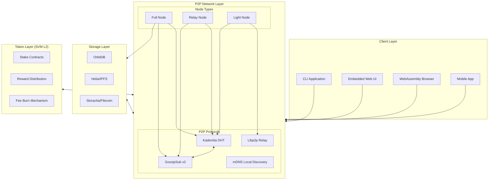

## Peer Discovery Protocol

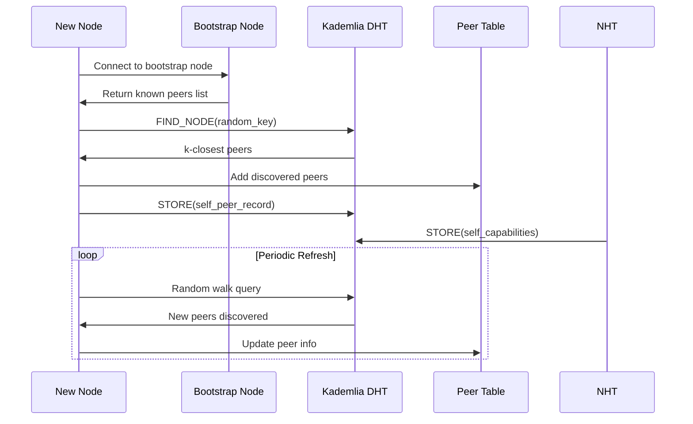

## Post Lifecycle State Machine

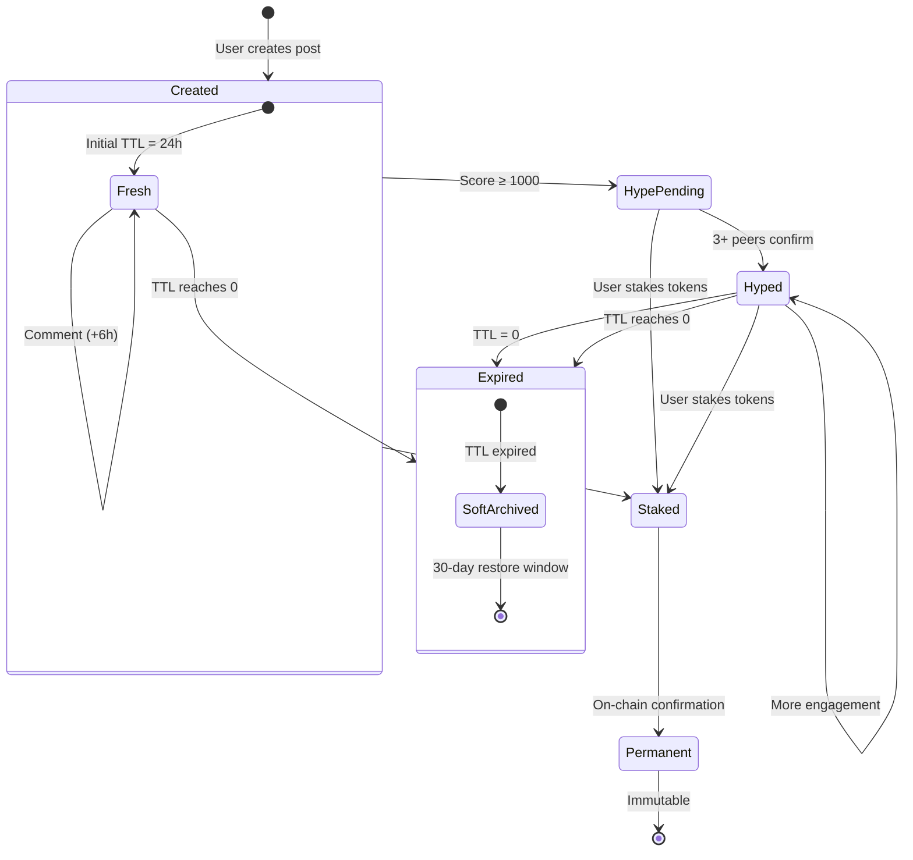

## Authorized Host Handshake

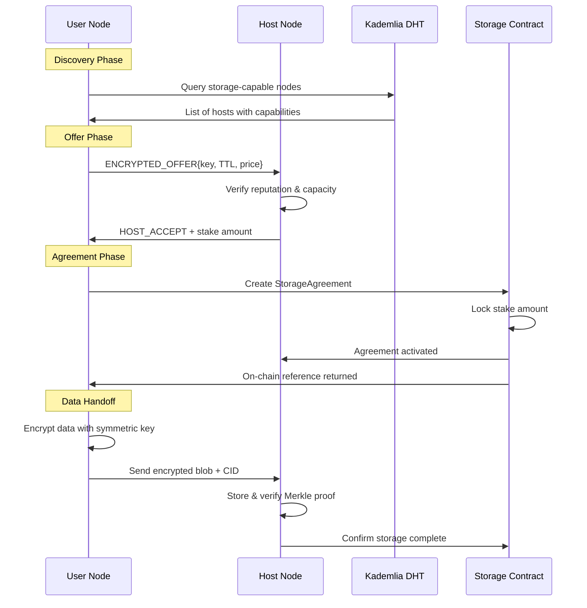

## Token Flow

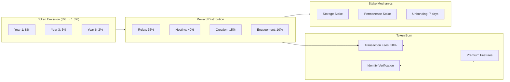

## Peer Table Management

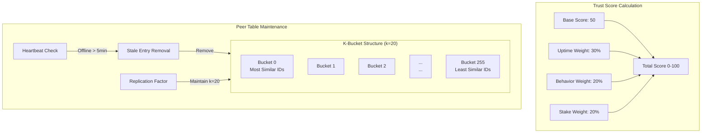

## Gossip Protocol

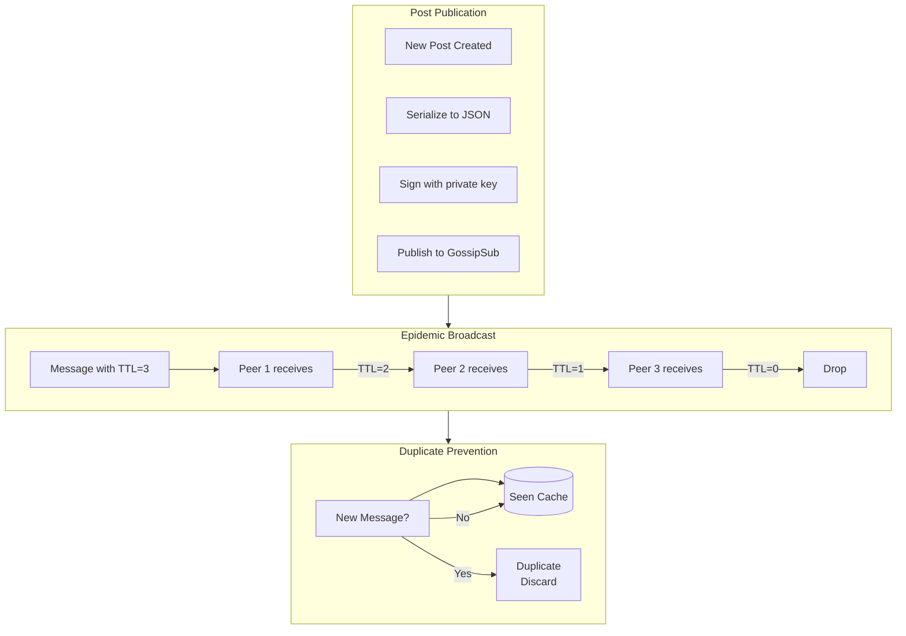

## Hype Algorithm

```mermaid
flowchart TB
    subgraph EngagementScoring["Engagement Score"]
        V[View: +1]
        S[Share: +10]
        C[Comment: +5]
        
        V --> TOTAL[Total Score]
        S --> TOTAL
        C --> TOTAL
    end
    
    subgraph TTLManagement["TTL Extension"]
        BASE[Base TTL: 24h]
        VB[View Bonus: +2h]
        SB[Share Bonus: +4h × (1 + rep/100)]
        CB[Comment Bonus: +6h × depth_factor]
        
        BASE --> EXT[Extended TTL]
        VB --> EXT
        SB --> EXT
        CB --> EXT
    end
    
    subgraph StateTransitions["State Transitions"]
        FRESH[Fresh Post<br/>Score < 100]
        HYPE[Hyped Post<br/>Score ≥ 1000]
        PERM[Permanent<br/>Staked]
        
        FRESH -->|Score ≥ 1000| HYPE
        FRESH -->|Stake tokens| PERM
        HYPE -->|Stake tokens| PERM
    end
```

## Risk Mitigation

```mermaid
flowchart TB
    subgraph Churn["Node Churn"]
        CH1[Host goes offline]
        CH2[Grace period: 24h]
        CH3[Re-replication triggered]
        CH4[Stake slashed]
        CH5[User notified]
        
        CH1 --> CH2 --> CH3 --> CH4 --> CH5
    end
    
    subgraph Inflation["Inflation Control"]
        IN1[Hard cap: 1B tokens]
        IN2[Disinflation: -15%/year]
        IN3[Fee burn: 50%]
        IN4[Staking lock: 7 days]
        
        IN1 --> IN2 --> IN3 --> IN4
    end
    
    subgraph Sybil["Sybil Resistance"]
        SY1[Min stake: 100 tokens]
        SY2[Time-weighted reputation]
        SY3[Social graph validation]
        SY4[Capacity proof]
        
        SY1 --> SY2 --> SY3 --> SY4
    end
```

## Technology Stack Summary

| Component | Technology | Purpose |
|-----------|------------|---------|
| **Node Client** | C++17 (static inline headers) | Zero-dependency P2P networking |
| **Database** | EncryptedStorageEntry + MerkleProof | Distributed content-addressed storage |
| **Storage Bridge** | EncryptedDataHandoff + StorageAgreement | Peer-to-peer storage contracts |
| **Token Layer** | MYCELIUM token (RewardPool) | Social mining rewards |
| **Identity** | Ed25519 + UsernameRegistry | Key-based identity management |
| **Consensus** | Proof of Stake | Network security |
| **Video Hosting** | ChunkedFile + StreamingSlot | P2P video distribution |
| **Web UI** | Embedded HTML in header | Built-in HTTP listener on `--http-port` |

## Roadmap Phases

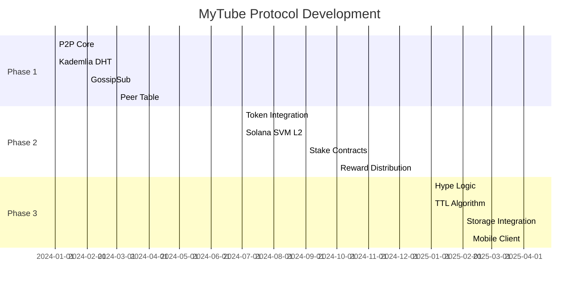

---

## Quantum-Resistant Security Architecture

### Cryptographic Design Philosophy

MyTube implements **hybrid cryptography** that combines current-generation algorithms (for compatibility) with post-quantum algorithms (for future-proofing). This approach ensures security against both classical and quantum adversaries.

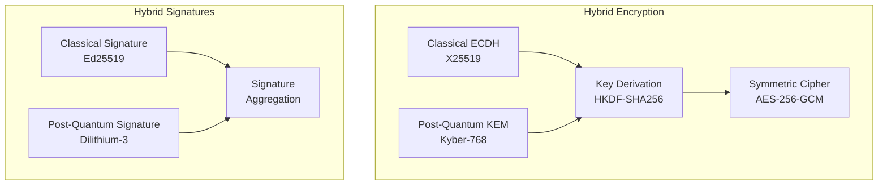

### Key Exchange Protocol

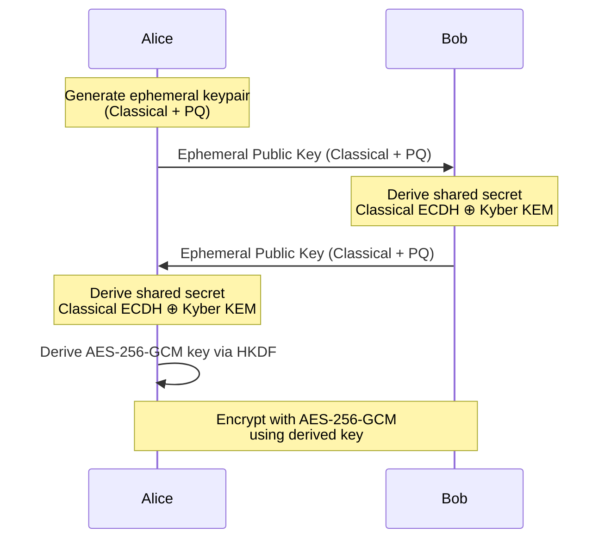

### Encryption Flow

```
┌─────────────────────────────────────────────────────────────┐
│                   ENCRYPTION PIPELINE                        │
├─────────────────────────────────────────────────────────────┤
│  1. PLAINTEXT INPUT                                         │
│     └── User content (post, media, messages)                 │
│                                                              │
│  2. KEY GENERATION                                          │
│     ├── Classical: X25519 keypair (32 bytes)                │
│     ├── Post-Quantum: Kyber-768 KEM (1184 bytes)           │
│     └── Combined: Hybrid ephemeral keypair                  │
│                                                              │
│  3. KEY EXCHANGE                                            │
│     ├── ECDH shared secret: 32 bytes                        │
│     ├── Kyber shared secret: 32 bytes                       │
│     └── XOR combined: 32 bytes                              │
│                                                              │
│  4. KEY DERIVATION                                          │
│     └── HKDF-SHA256(combined_secret, "SOVEREIGN-v1")        │
│         └── AES-256 key: 32 bytes                           │
│                                                              │
│  5. ENCRYPTION                                              │
│     └── AES-256-GCM                                         │
│         ├── Nonce: 12 bytes                                 │
│         ├── Ciphertext: variable                             │
│         └── Auth Tag: 16 bytes                              │
│                                                              │
│  6. OUTPUT                                                  │
│     └── Encrypted blob + ephemeral public key               │
└─────────────────────────────────────────────────────────────┘
```

### Security Levels

| Algorithm | Type | Key Size | Security Level | Status |
|-----------|------|----------|----------------|--------|
| **X25519** | ECDH | 256-bit | Classical only | Production |
| **Kyber-768** | KEM | 3040-bit | Level 5 (256-bit) | Hybrid-ready |
| **AES-256-GCM** | AEAD | 256-bit | Level 5 | Production |
| **Ed25519** | Sig | 256-bit | Classical only | Production |
| **Dilithium-3** | Sig | Level 5 | Level 5 (256-bit) | Hybrid-ready |

### Post-Quantum Key Types

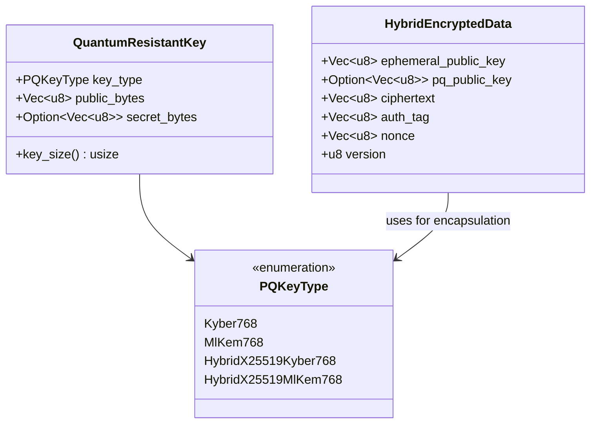

### Data at Rest Encryption

All user data stored on nodes is encrypted using hybrid encryption:

```
┌─────────────────────────────────────────────────────────────┐
│                STORAGE ENCRYPTION MODEL                      │
├─────────────────────────────────────────────────────────────┤
│                                                              │
│  User Data ──► User's KeyPair ──► Hybrid Encryption ──► Encrypted Blob
│                  (X25519 +                                       │
│                   Kyber768)                                    │
│                                                              │
│  ┌─────────────────────────────────────────────────────────┐ │
│  │ EncryptedStorageEntry                                    │ │
│  │ ├── entry_id: UUID                                      │ │
│  │ ├── content_cid: Qm...                                  │ │
│  │ ├── encrypted_content: Vec~u8~ (hybrid encrypted)       │ │
│  │ ├── encryption_metadata:                                │ │
│  │ │   ├── algorithm: "HybridX25519Kyber768_AES256GCM"   │ │
│  │ │   ├── key_type: "Kyber-768"                          │ │
│  │ │   ├── nonce: [u8; 12]                               │ │
│  │ │   └── merkle_root: String                            │ │
│  │ └── size_bytes: u64                                     │ │
│  └─────────────────────────────────────────────────────────┘ │
│                                                              │
│  Only the owner's private key can decrypt the content.        │
│                                                              │
└─────────────────────────────────────────────────────────────┘
```

### Signature Schemes

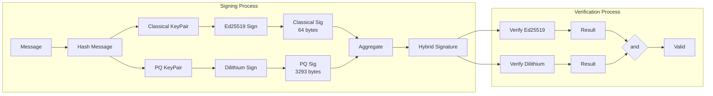

### Key Management

```
┌─────────────────────────────────────────────────────────────┐
│                   KEY MANAGEMENT                            │
├─────────────────────────────────────────────────────────────┤
│                                                              │
│  User Identity Key                                          │
│  ├── Stored: User's device (secure enclave)                 │
│  ├── Backup: User-controlled recovery phrase                │
│  └── Use: Signing posts, authorizing actions               │
│                                                              │
│  Storage Encryption Key                                      │
│  ├── Derived: From identity key via HKDF                    │
│  ├── Use: Encrypting/decrypting stored content             │
│  └── Sharing: Encrypted with recipient's public key        │
│                                                              │
│  Session Keys                                               │
│  ├── Ephemeral: Generated per session/message               │
│  ├── Use: Forward secrecy                                   │
│  └── Destroyed: After session ends                         │
│                                                              │
└─────────────────────────────────────────────────────────────┘
```

### Security Properties

| Property | Implementation | Quantum Resistant |
|----------|----------------|-------------------|
| **Confidentiality** | AES-256-GCM + Kyber-768 | Yes |
| **Integrity** | GCM authentication tag | Yes |
| **Authentication** | Ed25519 + Dilithium-3 | Yes |
| **Forward Secrecy** | Ephemeral key exchange | Yes* |
| **Post-Compromise Security** | Key rotation | Yes |
| **Non-Repudiation** | Digital signatures | Yes |

*Ephemeral key exchange provides forward secrecy against classical adversaries. Quantum forward secrecy requires PQ ephemeral keys.

### Migration Path

```
Phase 1 (Current):  Classical-only encryption (X25519 + Ed25519)
     │
     ▼
Phase 2 (Planned):  Hybrid mode (X25519 + Kyber + Ed25519 + Dilithium)
     │
     ▼
Phase 3 (Future):   Post-quantum only (when PQ performance improves)
```

### Benchmarking

| Operation | Classical | Hybrid | PQ-Only |
|-----------|-----------|--------|----------|
| Key Generation | ~1ms | ~15ms | ~15ms |
| Key Exchange | ~2ms | ~12ms | ~10ms |
| Encrypt (1KB) | ~0.1ms | ~0.2ms | ~0.2ms |
| Encrypt (1MB) | ~10ms | ~20ms | ~20ms |
| Decrypt (1KB) | ~0.1ms | ~0.2ms | ~0.2ms |
| Sign | ~0.5ms | ~3ms | ~3ms |
| Verify | ~0.5ms | ~3ms | ~3ms |

### Implementation Modules

| Module | Path | Description |
|--------|------|-------------|
| **myc-crypto** | `crates/crypto/` | Core cryptographic operations |
| ├─ keys.rs | Key generation, X25519/Ed25519 |
| ├─ encryption.rs | AES-256-GCM encryption |
| ├─ signatures.rs | Ed25519 signing |
| ├─ hybrid.rs | Hybrid encryption/signing |
| └─ quantum_resistant.rs | Kyber/Dilithium structures |
| **myc-storage** | `crates/storage/` | Encrypted storage layer |
| **myc-post** | `crates/post/` | Encrypted post content |

### Future Upgrades

- **ML-KEM-768**: Replace Kyber-768 with NIST-standardized ML-KEM
- **SLH-DSA**: Add SPHINCS+ for hash-based signatures (stateless)
- **Threshold Cryptography**: Multi-party decryption keys for recovery
- **ZKP Integration**: Zero-knowledge proofs for privacy-preserving actions

---

## Profile System Architecture

### Overview

MyTube implements a fully customizable user profile system with privacy-first design. Users own their profile data, which is encrypted and stored in the distributed network.

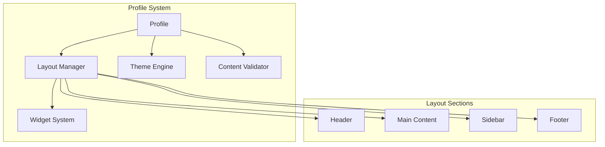

### Profile Structure

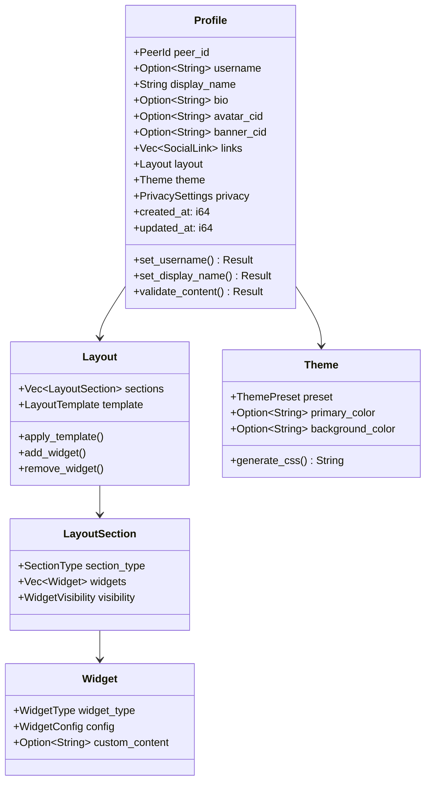

### Layout Templates

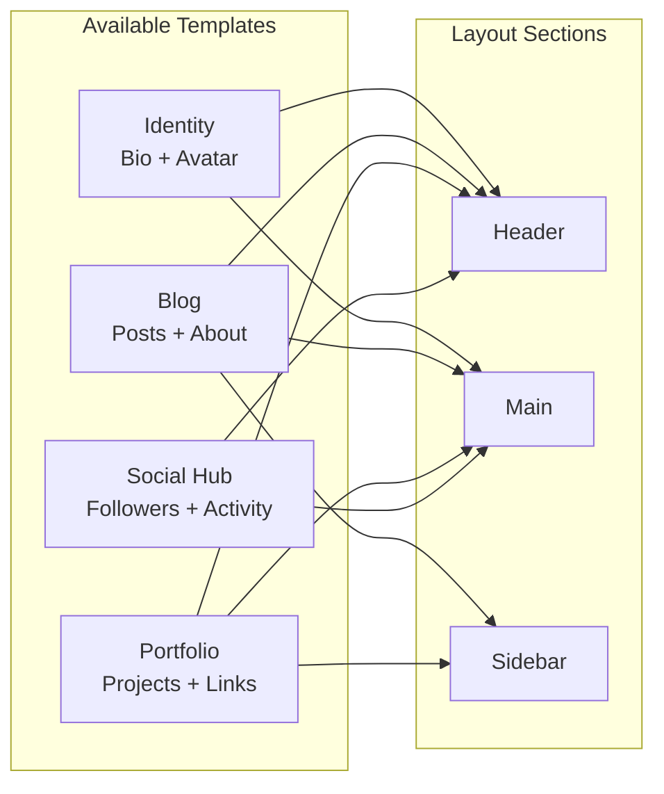

### Theme Presets

| Preset | Primary | Background | Accent | Use Case |
|--------|---------|------------|--------|----------|
| **Midnight** | `#6366F1` | `#0F172A` | `#818CF8` | Dark theme |
| **Ocean** | `#0EA5E9` | `#0C4A6E` | `#38BDF8` | Blue aesthetic |
| **Forest** | `#22C55E` | `#14532D` | `#4ADE80` | Nature theme |
| **Sunset** | `#F97316` | `#7C2D12` | `#FB923C` | Warm tones |
| **Minimal** | `#6B7280` | `#F9FAFB` | `#9CA3AF` | Clean, simple |
| **Hacker** | `#10B981` | `#111827` | `#34D399` | Terminal style |
| **Aurora** | `#8B5CF6` | `#1E1B4B` | `#A78BFA` | Purple glow |

### Content Validation

All user content passes through a privacy-first validator:

```
┌─────────────────────────────────────────────────────────────┐
│                CONTENT VALIDATION PIPELINE                   │
├─────────────────────────────────────────────────────────────┤
│                                                              │
│  User Input ──► PII Detection ──► Spam Check ──► Approved   │
│                      │                   │                   │
│                      ▼                   ▼                   │
│              Email patterns         Excessive caps           │
│              Phone numbers         Repetitive chars          │
│              Street addresses      Suspicious links          │
│              SSN patterns          Auto-generated content     │
│                                                              │
│  Display Names: Allowed (non-PII only)                      │
│  Bio: Allowed with validation                                │
│  Links: Allowed with URL validation                          │
│                                                              │
└─────────────────────────────────────────────────────────────┘
```

---

## Guestbook System

### Overview

Inspired by the indie web movement, the guestbook allows visitors to leave public messages on user profiles. All entries require approval based on the owner's policy.

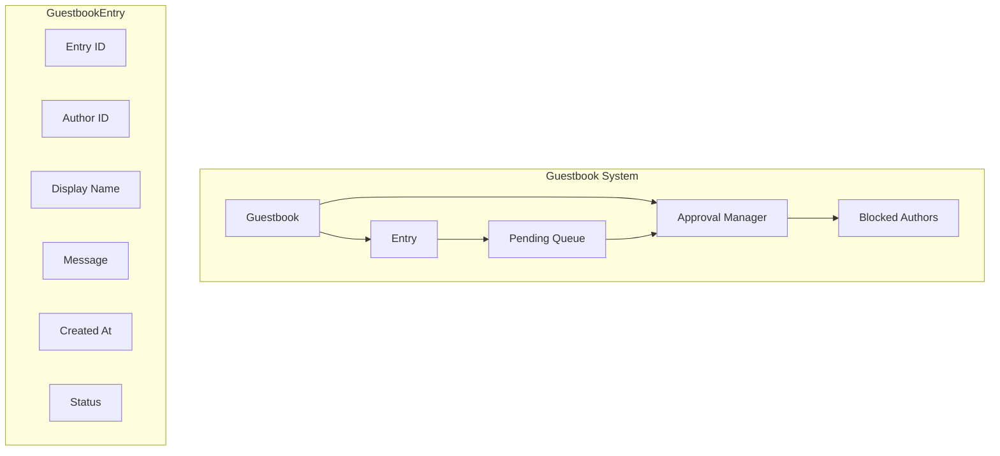

### Approval Policies

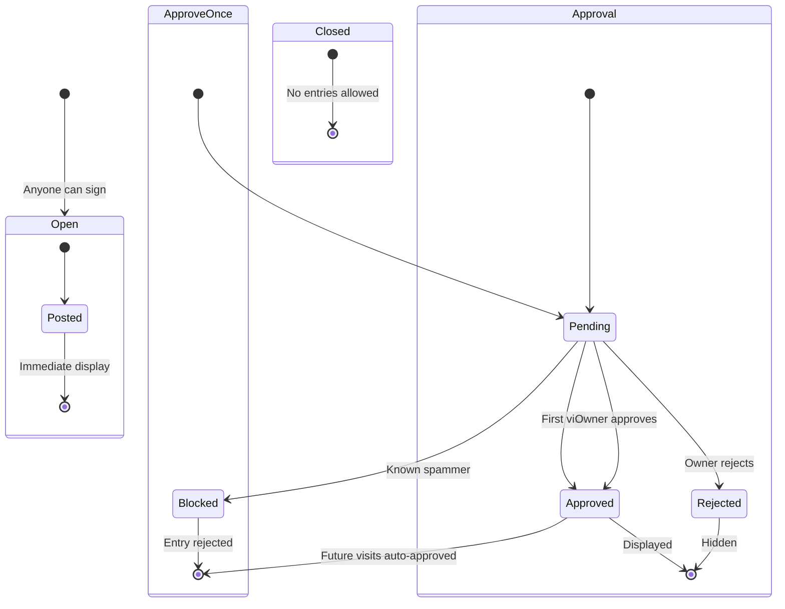

### Guestbook Entry Lifecycle

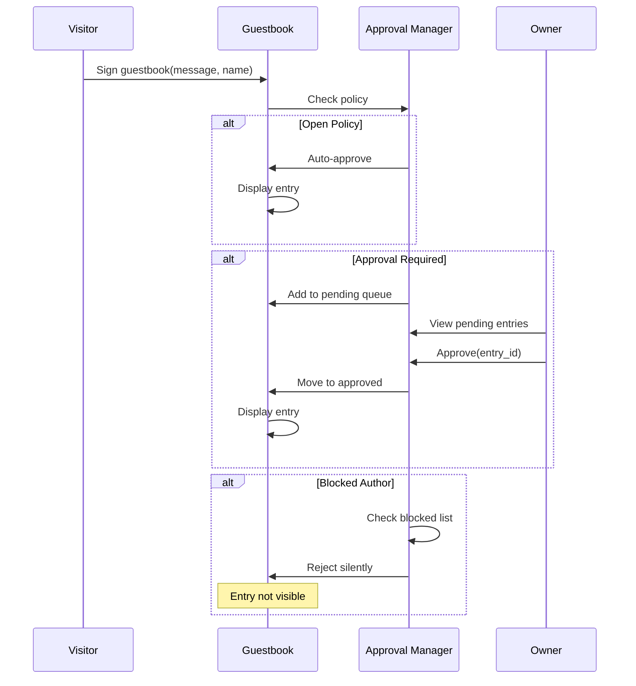

---

## Social Graph

### Overview

The social graph tracks user relationships including follows, followers, and blocks. All operations respect user privacy settings.

```mermaid
flowchart TB
    subgraph SocialGraph["Social Graph"]
        SG[Social Graph]
        F[Follows]
        FR[Followers]
        B[Block List]
        P[Privacy Settings]
    end
    
    subgraph PrivacyControls["Privacy Controls"]
        PV[Profile Visibility]
        GP[Guestbook Policy]
        FA[Follow Approval]
        DM[DM Policy]
    end
    
    SG --> F
    SG --> FR
    SG --> B
    SG --> P
    P --> PV
    P --> GP
    P --> FA
    P --> DM
```

### Relationship States

```mermaid
stateDiagram-v2
    [*] --> None: No relationship
    
    None --> Following: User A follows B
    Following --> [*]: User A unfollows B
    
    None --> Follower: User B follows A
    Follower --> [*]: User B unfollows A
    
    None --> Mutual: A→B and B→A
    Mutual --> Following: B unfollows A
    Mutual --> Follower: A unfollows B
    
    None --> Blocked: A blocks B
    Blocked --> None: A unblocks B
    
    Following --> Blocked: A blocks B
    Mutual --> Blocked: A blocks B
```

### Privacy Policies

```mermaid
flowchart LR
    subgraph ProfileVisibility["Profile Visibility"]
        PUB[Public]
        HID[Hidden]
        UNC[Unlisted]
    end
    
    subgraph GuestbookPolicy["Guestbook Policy"]
        O[Open]
        AO[ApproveOnce]
        AR[Approval Required]
        CL[Closed]
    end
    
    subgraph DMPolicy["DM Policy"]
        AL[Allow All]
        FO[Followers Only]
        NO[No One]
    end
    
    subgraph FollowApproval["Follow Approval"]
        Y[Yes - Require Approval]
        N[No - Auto-approve]
    end
```

---

## DHT Identity Registry

### Overview

Decentralized username registration and lookup using the Kademlia DHT. Usernames are first-come, first-served and stored as content-addressed records.

```mermaid
flowchart TB
    subgraph Identity["Identity Registry"]
        I[Identity Manager]
        R[Registry]
        L[Lookup Service]
        D[Discovery]
    end
    
    subgraph Records["Registry Records"]
        U[Username Record]
        P[Profile CID]
        K[Public Key]
        T[Timestamp]
        S[Signature]
    end
    
    I --> R
    I --> L
    I --> D
    R --> U
    U --> P
    U --> K
    U --> T
    U --> S
```

### Username Registration Flow

```mermaid
sequenceDiagram
    participant U as User
    participant I as Identity Manager
    participant DHT as Kademlia DHT
    participant BC as Blockchain
    
    Note over U: Generate keypair
    
    U->>I: Register username("alice")
    I->>I: Check username validity
    I->>I: Generate UsernameRecord
    I->>I: Sign record with private key
    
    I->>DHT: PUT(username_record)
    DHT->>DHT: Store at username hash
    
    Note over DHT: Content-addressed storage
    Note over DHT: CID = hash(username + key + timestamp)
    
    DHT->>I: Storage confirmed
    I->>U: Registration successful
    I->>BC: Optional on-chain anchoring
```

### Identity Lookup

```mermaid
sequenceDiagram
    participant C as Client
    participant I as Identity Service
    participant DHT as Kademlia DHT
    
    C->>I: Lookup("alice")
    I->>DHT: GET(username_hash)
    DHT->>DHT: Find closest peers
    
    alt Username Found
        DHT->>I: UsernameRecord
        I->>I: Verify signature
        I->>C: Profile CID + Public Key
    else Username Not Found
        DHT->>I: Not found
        I->>C: Error: Username not registered
    end
```

### Username Constraints

| Rule | Constraint |
|------|------------|
| **Length** | 3-32 characters |
| **Characters** | a-z, 0-9, underscore, hyphen |
| **Case** | Case-insensitive (stored lowercase) |
| **Reserved** | system usernames (admin, root, etc.) |
| **Uniqueness** | First-come, first-served via DHT |

---

## Implementation Modules Summary

| Module | Path | Description |
|--------|------|-------------|
| **myc-profile** | `crates/myc-profile/` | User profiles, layouts, themes |
| ├─ profile.rs | Profile struct and validation |
| ├─ layout.rs | Layout sections and widgets |
| ├─ theme.rs | Theme presets and CSS generation |
| ├─ widget.rs | Widget types and configs |
| └─ validation.rs | PII detection, content filtering |
| **myc-guestbook** | `crates/myc-guestbook/` | Guestbook entries and approval |
| ├─ entry.rs | GuestbookEntry struct |
| ├─ pending.rs | Pending queue management |
| └─ approval.rs | Approval policies |
| **myc-social** | `crates/myc-social/` | Social graph and privacy |
| ├─ graph.rs | Follow/follower relationships |
| └─ privacy.rs | Privacy settings and policies |
| **myc-identity** | `crates/myc-identity/` | DHT username registry |
| ├─ registry.rs | Username registration |
| ├─ lookup.rs | Username resolution |
| └─ discovery.rs | Service discovery |

---

## Complete Crate Architecture

```
mycelium/
├── Cargo.toml                    # Workspace root
│
├── bin/
│   └── mycelium-node/           # CLI application
│       └── src/
│           ├── main.rs          # Command handlers
│           └── wallet.rs        # Wallet utilities
│
└── crates/
    ├── myc-crypto/              # Cryptographic operations
    ├── myc-p2p/                 # P2P networking (libp2p)
    ├── myc-storage/             # Distributed storage
    ├── myc-post/                # Post creation and lifecycle
    ├── myc-protocol/            # Protocol specifications
    ├── myc-token/               # Tokenomics and rewards
    ├── myc-profile/             # User profiles & customization
    ├── myc-guestbook/           # Guestbook system
    ├── myc-social/              # Social graph & relationships
    └── myc-identity/            # DHT username registry
```

---

## Feature Status

| Feature | Status | Notes |
|---------|--------|-------|
| P2P Networking | ✅ Implemented | Peer table, gossip protocol types |
| Post Lifecycle | ✅ Implemented | TTL, Hype, Permanence |
| Tokenomics | ✅ Implemented | Emission, staking, rewards |
| Quantum Encryption | ✅ Implemented | Hybrid X25519+Kyber |
| User Profiles | ✅ Implemented | Layout, themes, widgets |
| Guestbook | ✅ Implemented | Approval-based entries |
| Social Graph | ✅ Implemented | Follow/follower/block |
| Identity Registry | ✅ Implemented | DHT username lookup |
| Video Hosting | ✅ Implemented | Chunked encryption, streaming slots, bandwidth-weighted rewards |
| Web UI / HTTP Server | ✅ Implemented | Embedded YouTube-style HTML page, `--http-port` flag |
| Onion / Tor Integration | ✅ Implemented | `.onion` derivation from Ed25519, `--tor` CLI flags |
| Storage Integration | 🔄 In Progress | Encrypted data handoff with Merkle proofs |
| Real P2P Transport | 🔄 In Progress | TCP/UDP socket integration |

---

## Video Hosting Architecture

### Overview

The video hosting subsystem enables P2P distribution of encrypted chunked video content. Videos are split into fixed-size chunks (4 MB default), each with its own CID, Merkle hash, and optional encryption key. Peers advertise `kCapVideoHosting` to indicate they can serve video chunks and reserve streaming bandwidth.

### Chunked Video Structure

```
┌─────────────────────────────────────────────────────────────┐
│                    VIDEO MANIFEST                            │
├─────────────────────────────────────────────────────────────┤
│  VideoMetadata                                              │
│  ├── video_id: string                                       │
│  ├── codec: H.264 / H.265 / VP9 / AV1                      │
│  ├── width x height: resolution                             │
│  ├── duration_ms: playback duration                         │
│  ├── bitrate_bps: encoding bitrate                          │
│  ├── thumbnail_cid: preview image                           │
│  ├── chunk_size_bytes: 4 MB default                         │
│  └── chunks[]:                                              │
│      ├── chunk_cid: content-addressed chunk                  │
│      ├── index: sequential order                            │
│      ├── byte_offset: position in original file             │
│      ├── byte_length: chunk size                            │
│      ├── chunk_hash: SHA-256 of chunk data                  │
│      └── host_peer_id: which peer stores this chunk         │
└─────────────────────────────────────────────────────────────┘
```

### Streaming Slot Reservation

```mermaid
sequenceDiagram
    participant C as Consumer Node
    participant H as Host Node (kCapVideoHosting)
    participant G as Gossip Network
    
    Note over C: Request video chunks
    C->>G: kGossipVideoChunkRequest(video_cid, chunk_index)
    G->>H: Forward request to capable hosts
    
    H->>H: Check StreamingSlot availability
    H->>H: Reserve bandwidth (max_concurrent_streams)
    
    alt Slot Available
        H->>G: kGossipVideoChunkResponse(chunk_cid, encrypted_data)
        G->>C: Forward response
    else All Slots Full
        H->>G: kGossipVideoChunkResponse(reject, reason)
    end
```

### Bandwidth-Weighted Rewards

```mermaid
flowchart LR
    subgraph VideoRewards["Video Hosting Rewards"]
        S[Storage Share<br/>GB stored / Total GB]
        B[Bandwidth Share<br/>Mbps served / Total Mbps]
        T[Total = Storage + Bandwidth]
    end
    
    S --> T
    B --> T
    T --> R[claim_video_hosting reward]
```

Video hosting rewards use a bandwidth multiplier: peers who serve more Mbps receive a proportionally larger share of the hosting reward pool, incentivizing high-bandwidth nodes.

### Integration Points

| Component | File | Role |
|-----------|------|------|
| Video Metadata | `src/media/myc_video.hpp` | VideoMetadata, ChunkEntry, codec enum |
| Post Attachment | `src/post/myc_post.hpp` | PostContent.video_cid + PostContent.video_meta |
| Peer Capability | `src/p2p/myc_p2p.hpp` | kCapVideoHosting, max_concurrent_streams |
| Streaming Slots | `src/storage/myc_storage.hpp` | StreamingSlot bandwidth reservation |
| Video Gossip | `src/p2p/myc_p2p.hpp` | kGossipVideoChunkRequest/Response |
| Token Rewards | `src/token/myc_token.hpp` | claim_video_hosting with bandwidth weight |
| CLI Commands | `src/main.cpp` | `video upload`, `video manifest` |
| Web UI / HTTP Server | `src/web/myc_web.hpp` | Embedded HTML page (`kMyTubeWebPage`), `serve_http_page()` |
| Web UI / HTTP Server | `src/main.cpp` | `--http-port` CLI flag, socket accept loop |
| Tor / Onion | `src/crypto/myc_crypto.hpp` | `.onion` address derivation from Ed25519 pubkey |
| Tor / Onion | `src/p2p/myc_p2p.hpp` | `enable_tor`, `onion_address` in node info |
| Tor / Onion | `src/main.cpp` | `--tor`, `--tor-socks-port`, `--tor-control-port` CLI flags |

---

## Tor / Onion Integration

### Overview

MyTube supports running nodes over the Tor network using **Tor v3 onion services**. Each node can generate a unique `.onion` address from its Ed25519 key pair, allowing peers to connect via the Tor network for privacy-preserving communication — no central server, no IP exposure.

### Onion Address Derivation

MyTube derives Tor v3 onion addresses entirely from its existing Ed25519 crypto — no external Tor libraries required:

```
Ed25519 Public Key (32 bytes)
        │
        ▼
SHA-256(".onion checksum" || pubkey || 0x03)
        │
        ▼
checksum[0:2] + pubkey + 0x03  (35 bytes total)
        │
        ▼
base32 encode → "6d25zrjyq3ogsttacnjpu3gvhnyrudsncrrzqd3do5kw32jhpvzzxryd.onion"
```

The resulting 56-character `.onion` address is stored in `LocalNodeInfo::onion_address` and displayed in the CLI.

### Configuration

| CLI Flag | Type | Default | Description |
|----------|------|---------|-------------|
| `--tor` | flag | off | Enable Tor hidden service mode |
| `--tor-socks-port` | uint16 | 9050 | Tor SOCKS5 proxy port for outbound connections |
| `--tor-control-port` | uint16 | 9051 | Tor control port for hidden service setup |

### P2pConfig Fields

```cpp
struct P2pConfig {
    // ... existing fields ...
    bool enable_tor = false;
    uint16_t tor_socks_port = 9050;
    uint16_t tor_control_port = 9051;
    std::string onion_service_dir;   // directory to persist the HS private key
};
```

### Architecture

```mermaid
flowchart TB
    subgraph MyTubeNode["MyTube Node (--tor)"]
        KEY[Ed25519 Keypair]
        ONION[Onion Address<br/>56-char .onion]
        SOCKS[SOCKS5 Proxy<br/>localhost:9050]
        CTRL[Control Port<br/>localhost:9051]
    end
    
    subgraph TorDaemon["Tor Daemon (external)"]
        HS[Tor Hidden Service]
        CIRC[Tor Circuits]
    end
    
    KEY -->|derive| ONION
    ONION -->|register| HS
    SOCKS -->|outbound| CIRC
    CTRL -->|setup| HS
    
    HS -->|peers connect via| CIRC
    CIRC -->|anonymous| P2P[P2P Network]
```

### CLI Example

```bash
# Start node with Tor enabled
./build/Release/mycelium start --tor

# Start with custom SOCKS port (e.g., Tor Browser Bundle)
./build/Release/mycelium start --tor --tor-socks-port 9150
```

### Zero-Dependency Approach

| Requirement | Implementation | Status |
|------------|----------------|--------|
| Ed25519 key generation | `myc_crypto.hpp` — existing `ed25519_keygen` | ✅ Existing |
| SHA-256 checksum | `myc_crypto.hpp` — existing `sha256` | ✅ Existing |
| Base32 encoding | `myc_crypto.hpp` — new `base32_encode` | ✅ Added |
| Onion address derivation | `myc_crypto.hpp` — `onion_address_from_pubkey` | ✅ Added |
| SOCKS5 proxy client | Real socket code (Phase 2 transport) | 🔄 Planned |
| Control port protocol | Real socket code (Phase 2 transport) | 🔄 Planned |

The node generates and displays its `.onion` address immediately. Actual SOCKS5 proxy connections and hidden service registration via the control port will be wired when the real TCP transport layer is implemented. Until then, the node advertises its `.onion` address in peer announcements and is ready for privacy-preserving connections.

---

## Embedded Web UI

### Overview

MyTube ships with a **YouTube-style embedded web interface** compiled directly into the binary. The entire HTML/CSS landing page (`kMyTubeWebPage`) is stored as a C++ raw string literal in `src/web/myc_web.hpp` — no external HTTP server, no static files, no web framework.

### Architecture

```mermaid
flowchart TB
    subgraph Binary["mycelium.exe (~128 KB)"]
        CLI[CLI Commands]
        WEB[kMyTubeWebPage<br/>Raw HTML String]
        HTTP[HTTP Listener<br/>std::thread]
        NODE[Mycelium Node]
    end
    
    subgraph Browser["Browser"]
        PAGE[YouTube-style UI<br/>Pure HTML+CSS]
    end
    
    USER[User runs<br/>--http-port 8080]
    USER --> CLI
    CLI --> HTTP
    HTTP -->|accept| WEB
    WEB -->|HTTP response| PAGE
    NODE -->|node info| WEB
```

### Server Implementation

The HTTP listener is a minimal synchronous TCP server running on the main thread:

```
┌─────────────────────────────────────────────────────────────┐
│                 HTTP REQUEST HANDLING                        │
├─────────────────────────────────────────────────────────────┤
│                                                              │
│  1. socket() → AF_INET, SOCK_STREAM                         │
│  2. bind() → INADDR_ANY : <http_port>                       │
│  3. listen() → SOMAXCONN                                    │
│  4. loop:                                                   │
│     ├── accept() → client socket                            │
│     ├── recv() → read (and discard) HTTP request            │
│     ├── send() → HTTP/1.1 200 OK + headers                  │
│     ├── send() → kMyTubeWebPage (send-all loop)             │
│     ├── shutdown(SD_SEND)                                   │
│     └── closesocket()                                       │
│                                                              │
│  Runs until Ctrl+C or bind/accept failure.                   │
│                                                              │
└─────────────────────────────────────────────────────────────┘
```

### Page Content

The embedded landing page features:

- **Fixed navbar** with MyTube logo, search bar placeholder, and icon buttons
- **Dark sidebar** with Home, Trending, Videos, Storage navigation, subscriptions, and network stats
- **Red gradient banner** with welcome message, binary size, language, and QR badge
- **Video grid** (8 cards) showcasing protocol features with icon placeholders and duration badges
- **Tokenomics section** with total supply, emission rate, and reward distribution breakdown
- **Footer** with GitHub link, MIT license, and technology tagline
- **Responsive design** with mobile breakpoint at 768px (hides sidebar, stacks layout)

### Integration Points

| Component | File | Role |
|-----------|------|------|
| HTML Content | `src/web/myc_web.hpp` | `kMyTubeWebPage` — raw string literal (~10.8 KB) |
| HTTP Handler | `src/web/myc_web.hpp` | `serve_http_page()` — read request, send response, graceful shutdown |
| CLI Flag | `src/main.cpp` | `--http-port PORT` — enables HTTP listener |
| Tor Display | `src/main.cpp` | Shows `.onion` web URL when both `--http-port` and `--tor` are active |

### CLI Usage

```bash
# Start with web UI
./build/Release/mycelium start --http-port 8080

# Combined with Tor
./build/Release/mycelium start --http-port 8080 --tor
```

The node prints the local URL (`http://localhost:PORT`) and, if Tor is enabled, the `.onion` URL for privacy-preserving remote access.
